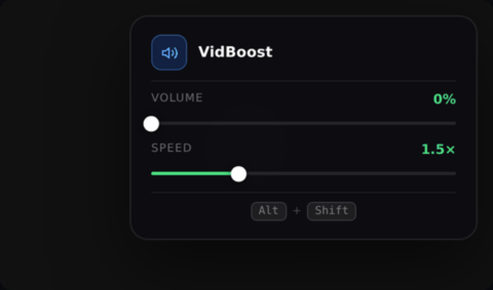

<div align="center">

# VidBoost

**A compact glassmorphism HUD for boosting video volume and controlling playback speed.**

[Created by **sgor-ai**](https://github.com/sgor-ai)

[](https://www.tampermonkey.net/)
[](https://github.com/sgor-ai/VidBoost)
[](LICENSE)

</div>

<p align="center">
  
</p>

<p align="center"><strong>Press <code>Alt</code> + <code>Shift</code>, tune the video, and keep watching.</strong></p>

## What is VidBoost?

VidBoost is a lightweight [Tampermonkey](https://www.tampermonkey.net/) userscript
that adds a small, unobtrusive control panel to webpages containing HTML5 video.
It uses the same dark, translucent glass panel for every site and keeps the
controls close to the active video.

The panel provides:

- **Volume boost** from `0%` to `1000%` using the Web Audio API.
- **Playback speed** from `0.5x` to `4.0x`.
- A live green, amber, and red volume indicator.
- A keyboard toggle with **Alt + Shift**.
- Automatic selection of the currently playing video.
- Support for pages with multiple video elements.

> VidBoost changes playback in your browser only. It does not download,
> re-encode, or upload videos.

## Install by copying the script

1. Install the [Tampermonkey browser extension](https://www.tampermonkey.net/).
2. Open [`vidboost.user.js`](vidboost.user.js).
3. Copy the complete code from the block below using GitHub's **Copy** button
   in the top-right corner of the code block.
4. Open the Tampermonkey dashboard and choose **Create a new script**.
5. Replace the starter template with the copied text.
6. Press **Ctrl+S** or choose **File > Save**.
7. Open a page containing an HTML5 video and press **Alt + Shift**.

The userscript matches all webpages by default so it also works on video
players embedded in sites that do not expose their own volume boost control.

This project is only a text userscript: there is no installer, build step, or
release download.

```javascript
// ==UserScript==
// @name         VidBoost - Volume & Speed Control
// @namespace    https://github.com/sgor-ai/VidBoost
// @version      1.0.0
// @description  A compact glassmorphism HUD for boosting video volume and adjusting playback speed.
// @author       sgor-ai
// @match        *://*/*
// @grant        none
// ==/UserScript==

(() => {
  let context = null;
  const audioNodesMap = new WeakMap();
  const MAX_GAIN = 10.0;
  let gain = 1.0;
  let guiVisible = false;
  let lock = false;

  const getVideo = () => {
    const videos = [...document.querySelectorAll("video")];
    return videos.find(v => !v.paused && !v.ended) || videos[0] || null;
  };

  const injectStyles = () => {
    if (document.getElementById("vb-styles")) return;
    const s = document.createElement("style");
    s.id = "vb-styles";
    s.textContent = `
      #vb-hud * { box-sizing:border-box; margin:0; padding:0; font-family:system-ui,-apple-system,sans-serif; }
      #vb-hud .vb-input {
        position:absolute; inset:0; opacity:0; cursor:pointer;
        width:100%; height:100%; margin:0;
      }
      #vb-hud .vb-thumb {
        position:absolute; top:50%; width:14px; height:14px;
        border-radius:50%; background:#fff;
        box-shadow:0 1px 6px rgba(0,0,0,0.6);
        transform:translate(-50%,-50%);
        pointer-events:none; transition:transform 0.12s;
      }
      #vb-hud .vb-track-wrap:hover .vb-thumb { transform:translate(-50%,-50%) scale(1.2); }
      #vb-hud .vb-kbd {
        font-family:monospace; font-size:10px;
        background:rgba(255,255,255,0.07);
        border:0.5px solid rgba(255,255,255,0.13);
        border-radius:5px; padding:2px 6px;
        color:rgba(255,255,255,0.4);
      }
    `;
    document.head.appendChild(s);
  };

  const createGUI = (video) => {
    if (!video) return null;
    let hud = document.getElementById("vb-hud");

    if (!hud) {
      injectStyles();

      hud = document.createElement("div");
      hud.id = "vb-hud";
      Object.assign(hud.style, {
        position: "absolute",
        top: "14px", right: "14px",
        width: "272px",
        background: "rgba(14,14,18,0.96)",
        backdropFilter: "blur(24px)",
        WebkitBackdropFilter: "blur(24px)",
        border: "0.5px solid rgba(255,255,255,0.10)",
        borderRadius: "16px",
        padding: "16px 18px",
        display: "flex",
        flexDirection: "column",
        gap: "9px",
        opacity: "0",
        transform: "translateY(-8px) scale(0.97)",
        transition: "opacity 0.2s ease, transform 0.2s ease",
        pointerEvents: "none",
        zIndex: "2147483647",
        boxShadow: "0 24px 64px rgba(0,0,0,0.55), 0 0 0 0.5px rgba(255,255,255,0.06)",
        color: "#fff",
      });

      hud.innerHTML = `
        <div style="display:flex;align-items:center;gap:10px;">
          <div style="width:32px;height:32px;border-radius:9px;background:rgba(37,99,235,0.22);border:0.5px solid rgba(96,165,250,0.35);display:flex;align-items:center;justify-content:center;flex-shrink:0;">
            <svg width="15" height="15" viewBox="0 0 24 24" fill="none" stroke="#60a5fa" stroke-width="2" stroke-linecap="round" stroke-linejoin="round">
              <polygon points="11 5 6 9 2 9 2 15 6 15 11 19 11 5"/>
              <path d="M19.07 4.93a10 10 0 0 1 0 14.14"/>
              <path d="M15.54 8.46a5 5 0 0 1 0 7.07"/>
            </svg>
          </div>

          <div>
            <div style="font-size:13px;font-weight:600;color:#fff;letter-spacing:0.01em;">
              VidBoost
            </div>
          </div>
        </div>

        <div style="height:0.5px;background:rgba(255,255,255,0.08);"></div>

        <div style="display:flex;flex-direction:column;gap:8px;">
          <div style="display:flex;justify-content:space-between;align-items:center;">
            <span style="font-size:10px;letter-spacing:0.08em;text-transform:uppercase;color:rgba(255,255,255,0.38);">Volume</span>
            <span id="vb-text" style="font-size:12px;font-weight:600;color:#4ade80;">100%</span>
          </div>
          <div class="vb-track-wrap" style="position:relative;height:14px;display:flex;align-items:center;">
            <div style="position:absolute;left:0;right:0;height:3px;background:rgba(255,255,255,0.10);border-radius:99px;"></div>
            <div id="vb-vol-fill" style="position:absolute;left:0;height:3px;border-radius:99px;background:#4ade80;width:10%;transition:width 0.06s,background 0.2s;"></div>
            <div class="vb-thumb" id="vb-vol-thumb" style="left:10%;"></div>
            <input class="vb-input" id="vb-slider" type="range" min="0" max="${MAX_GAIN}" step="0.05" value="1">
          </div>
        </div>

        <div style="display:flex;flex-direction:column;gap:8px;">
          <div style="display:flex;justify-content:space-between;align-items:center;">
            <span style="font-size:10px;letter-spacing:0.08em;text-transform:uppercase;color:rgba(255,255,255,0.38);">Speed</span>
            <span id="vb-speed-text" style="font-size:12px;font-weight:600;color:#4ade80;">1.0×</span>
          </div>
          <div class="vb-track-wrap" style="position:relative;height:14px;display:flex;align-items:center;">
            <div style="position:absolute;left:0;right:0;height:3px;background:rgba(255,255,255,0.10);border-radius:99px;"></div>
            <div id="vb-spd-fill" style="position:absolute;left:0;height:3px;border-radius:99px;background:#4ade80;width:14.3%;transition:width 0.06s;"></div>
            <div class="vb-thumb" id="vb-spd-thumb" style="left:14.3%;"></div>
            <input class="vb-input" id="vb-speed" type="range" min="0.5" max="4" step="0.5" value="1">
          </div>
        </div>

        <div style="height:0.5px;background:rgba(255,255,255,0.08);"></div>

        <div style="font-size:10px;color:rgba(255,255,255,0.25);text-align:center;display:flex;align-items:center;justify-content:center;gap:5px;">
          <kbd class="vb-kbd">Alt</kbd> + <kbd class="vb-kbd">Shift</kbd>
        </div>
      `;

      const slider = hud.querySelector("#vb-slider");
      const speed  = hud.querySelector("#vb-speed");

      slider.addEventListener("input", (e) => {
        gain = parseFloat(e.target.value);
        boostAudio(gain);
      });

      speed.addEventListener("input", (e) => {
        const v = parseFloat(e.target.value);
        const vid = getVideo();
        if (vid) vid.playbackRate = v;
        updateUI(gain, v);
      });

      document.body.appendChild(hud);

      // ✔️ FIX: inizializza subito UI (colore verde corretto)
      updateUI(gain, 1);
    }

    const container = video.parentElement;
    if (container) {
      container.style.position = "relative";
      if (hud.parentElement !== container) container.appendChild(hud);
    }
    return hud;
  };

  const toggleGUI = () => {
    const video = getVideo();
    if (!video) return;
    const hud = createGUI(video);
    if (!hud) return;
    guiVisible = !guiVisible;
    hud.style.opacity       = guiVisible ? "1" : "0";
    hud.style.transform     = guiVisible ? "translateY(0) scale(1)" : "translateY(-8px) scale(0.97)";
    hud.style.pointerEvents = guiVisible ? "auto" : "none";
  };

  const updateUI = (audioValue, speedValue = 1) => {
    const hud = document.getElementById("vb-hud");
    if (!hud) return;

    const color = audioValue > 7 ? "#f87171" : audioValue > 4 ? "#fbbf24" : "#4ade80";

    const text = hud.querySelector("#vb-text");
    if (text) {
      text.innerText = Math.round((audioValue / MAX_GAIN) * 1000) + "%";
      text.style.color = color;
    }

    const volFill  = hud.querySelector("#vb-vol-fill");
    const volThumb = hud.querySelector("#vb-vol-thumb");
    const volPct   = (audioValue / MAX_GAIN) * 100;
    if (volFill)  { volFill.style.width = volPct + "%"; volFill.style.background = color; }
    if (volThumb) volThumb.style.left = volPct + "%";

    const slider = hud.querySelector("#vb-slider");
    if (slider) slider.value = audioValue;

    const spdText  = hud.querySelector("#vb-speed-text");
    const spdFill  = hud.querySelector("#vb-spd-fill");
    const spdThumb = hud.querySelector("#vb-spd-thumb");
    const spdPct   = ((speedValue - 0.5) / 3.5) * 100;
    if (spdText)  spdText.innerText = speedValue.toFixed(1) + "×";
    if (spdFill)  spdFill.style.width = spdPct + "%";
    if (spdThumb) spdThumb.style.left = spdPct + "%";
  };

  const boostAudio = (value) => {
    if (!context) context = new (window.AudioContext || window.webkitAudioContext)();
    if (context.state === "suspended") context.resume();
    document.querySelectorAll("video").forEach(video => {
      try {
        let nodes = audioNodesMap.get(video);
        if (!nodes) {
          const source   = context.createMediaElementSource(video);
          const gainNode = context.createGain();
          source.connect(gainNode);
          gainNode.connect(context.destination);
          nodes = { source, gainNode };
          audioNodesMap.set(video, nodes);
        }
        nodes.gainNode.gain.value = value;
      } catch (e) {}
    });
    const v = getVideo();
    updateUI(value, v ? v.playbackRate : 1);
  };

  window.addEventListener("keydown", (e) => {
    if (e.altKey && e.shiftKey && !lock) { lock = true; toggleGUI(); }
  });
  window.addEventListener("keyup", () => { lock = false; });
})();
```

## Usage

### Open and close the HUD

Press **Alt + Shift** together. The panel appears in the top-right corner of
the active video. Press the same shortcut again to hide it.

### Volume

Drag **Volume** to set the gain:

| Range | Indicator |
| --- | --- |
| `0%` - `400%` | Green |
| `400%` - `700%` | Amber |
| `700%` - `1000%` | Red |

The value is intentionally shown as a percentage of normal volume. For
example, `250%` means approximately 2.5x gain.

### Speed

Drag **Speed** from `0.5x` for slow playback to `4.0x` for fast playback.
The value is applied to the active video immediately.

## Compatibility and limitations

- Works in modern Chromium, Firefox, and other browsers supported by
  Tampermonkey.
- Requires a page with at least one HTML5 `<video>` element.
- The active video is the first playing video, or the first video found when
  nothing is currently playing.
- Browser autoplay policies can keep the Web Audio context suspended until the
  first user interaction.
- Some protected or custom players may restrict media-element audio routing.

## Privacy

VidBoost has no network requests, no telemetry, no storage, and no external
dependencies. It only reads video elements on the current page and modifies
their local audio gain and playback rate.

## Project layout

```text
vidboost.user.js        Tampermonkey userscript
docs/media/
  vidboost-demo.gif     Supplied controls demonstration
LICENSE                 MIT license
README.md               Documentation
```

## Development

The userscript is intentionally self-contained. To work on it:

1. Edit `vidboost.user.js`.
2. Save it in Tampermonkey or reload the script from the dashboard.
3. Refresh the video page.
4. Press **Alt + Shift** and test both sliders.

No build step is required.

## Responsible use

Use VidBoost for videos you are allowed to watch and modify locally. Respect
the terms of service, accessibility needs, and volume limits of the websites
you use. High gain can damage hearing or speakers; start at a low value.

## License

VidBoost is released under the [MIT License](LICENSE).
